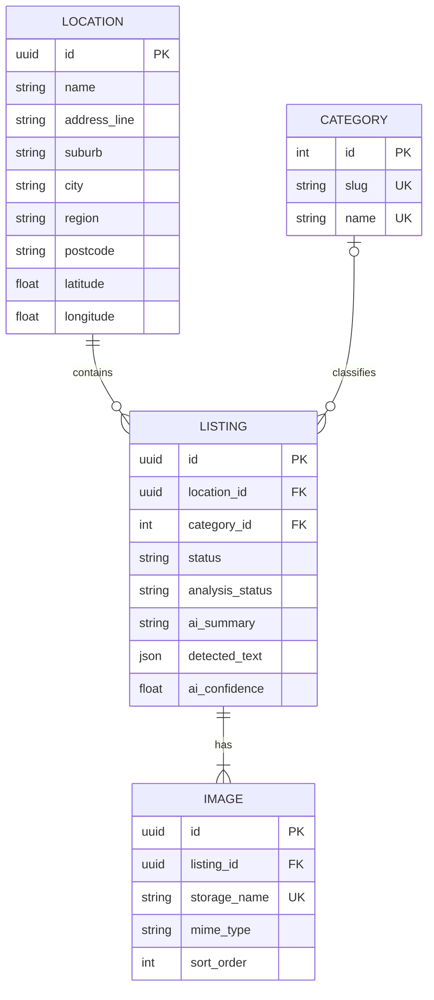

# Opping

We made second-hand first.

Opping is a hackathon MVP backend that turns photos of second-hand items into
reviewable marketplace listings. It stores images locally, uses Gemini vision
for identification/OCR/category suggestions, and falls back to an explicitly
labelled stub when no Gemini API key is configured.

## Data model



## Run locally

Requires Python 3.11 or newer.

```powershell
python -m venv .venv
.venv\Scripts\Activate.ps1
python -m pip install -e ".[dev]"
Copy-Item .env.example .env
uvicorn app.main:app --reload
```

The API is available at `http://127.0.0.1:8000`, interactive documentation at
`http://127.0.0.1:8000/docs`, and saved images under `/media/...`.

`AI_PROVIDER=auto` uses Gemini when `GEMINI_API_KEY` is set and otherwise uses
the stub. Set `AI_PROVIDER=gemini` to require Gemini or `AI_PROVIDER=stub` for a
predictable local demo and tests.

## Typical workflow

Create a reusable shop location:

```powershell
curl.exe -X POST http://127.0.0.1:8000/api/v1/locations `
  -H "Content-Type: application/json" `
  -d '{"name":"K Road Store","address_line":"123 Karangahape Road","city":"Auckland"}'
```

Create and analyze a draft (replace the location ID):

```powershell
curl.exe -X POST http://127.0.0.1:8000/api/v1/listings `
  -F "location_id=LOCATION_UUID" `
  -F "images=@front.jpg" `
  -F "images=@label.jpg"
```

Review with `PATCH /api/v1/listings/{id}`, then confirm with
`POST /api/v1/listings/{id}/publish`. Consumers can filter published listings:

```text
GET /api/v1/listings?category=clothing&location_id=LOCATION_UUID&page=1&page_size=20
```

## API endpoints

All JSON endpoints use the `/api/v1` prefix.

| Method | Endpoint | Purpose |
| --- | --- | --- |
| `GET` | `/health` | Check database and configured AI provider |
| `GET` | `/categories` | List the seeded category taxonomy |
| `GET` / `POST` | `/locations` | List or create shop locations |
| `PATCH` | `/locations/{id}` | Update a reusable shop location |
| `POST` | `/listings` | Upload 1–5 images and create/analyze a draft |
| `GET` / `PATCH` | `/listings/{id}` | Read or review a listing |
| `POST` | `/listings/{id}/images` | Add images to a listing |
| `DELETE` | `/listings/{id}/images/{image_id}` | Remove an image while retaining at least one |
| `POST` | `/listings/{id}/analyze` | Analyze or retry analysis of current images |
| `POST` | `/listings/{id}/publish` | Confirm and publish a reviewed draft |
| `GET` | `/listings` | Filter and paginate published listings |
| `GET` | `/media/...` | Retrieve a locally stored image |

See `/docs` for complete request and response schemas.

## Tests

```powershell
pytest
```
